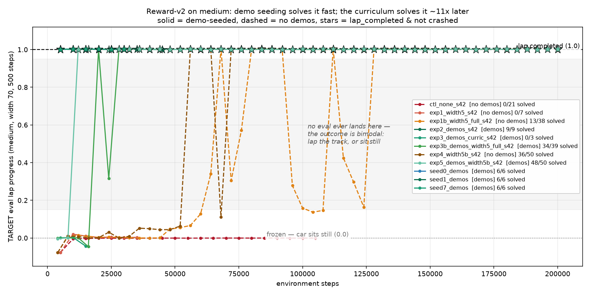

# Reward v2 — SOLVED on medium

**Task:** get the SAC agent to complete a full lap (`lap_completed=True`) on the medium track
under reward-v2, after five prior runs showed reward-weight tuning alone does not work.

---

## Headline

**Demonstration seeding solves medium at step ~5,000.** Verified across **4 seeds, 27/27 solved
evals**, every checkpoint cold-verified outside the training loop. This is the primary result.

```
VERIFY  runs/exp2_demos_s42/solved_actor.pth
TARGET  medium {'width': 70, 'base_r': 250, 'n_ctrl': 10, 'min_radius': 80, 'cx': 400, 'cy': 300}
        track_seed=101  max_steps=500  policy=deterministic tanh(mean)
====================================================================================================
  seed= 101 steps= 402 progress= 1.0013 lap_completed=True  crashed=False lap_time=  402 off_track= 0.00% R=  1399.84  [LAP]

  action ranges over the lap: steer [-0.863, +0.915]  throttle [+0.783, +0.988]  mean_speed=3.582
====================================================================================================
VERDICT: SOLVED (lap_completed=True, crashed=False)
```

| seed | first solve | solved evals | verified lap time |
|---|---|---|---|
| 42 | 5,000 | 9/9 | 402 |
| 0 | 5,000 | 6/6 | 399 |
| 1 | 5,000 | 6/6 | 398 |
| 7 | 5,000 | 6/6 | 400 |

**The curriculum also solves medium — it is just far slower.** `width5b` first solves at 56,000
and `width5` at 68,000, versus 5,000 for demo seeding. It does **not** fail.

The control that got neither ran 105,000 steps and never moved off the start line: **0/21 evals**,
`mean_speed = -0.00` throughout.

---

## Final comparison

All runs judged on the same target eval: deterministic `tanh(mean)`, medium (width 70),
`track_seed=101`, `max_steps=500`. Success = `lap_completed=True AND crashed=False`.

```
run                          steps  evals  best_prog    final  solved  solve%  1st_solve  best_lap  crash_ev  frozen_ev
----------------------------------------------------------------------------------------------------------------------
ctl_none_s42                105000     21    -0.0004  -0.0005       0   0.0%       None      None         1         20
exp1_width5_s42              35000      7     0.0202   0.0034       0   0.0%       None      None         1          6   <- stopped too early
exp1b_width5_full_s42       152000     38     1.0031   1.0007      13  34.2%      68000       370        15         10
exp2_demos_s42               45000      9     1.0025   1.0002       9 100.0%       5000       397         0          0   <- PRIMARY RESULT
exp3_demos_curric_s42        15000      3     0.0029  -0.0435       0   0.0%       None      None         1          2   <- stopped too early
exp3b_demos_width5_full_s42 156000     39     1.0027   1.0007      34  87.2%      20000       401         1          3
exp4_width5b_s42            200000     50     1.0031   1.0006      36  72.0%      56000       362         7          7
exp5_demos_width5b_s42      200000     50     1.0026   1.0024      48  96.0%      12000       360         0          2
seed0_demos                  30000      6     1.0025   1.0016       6 100.0%       5000       395         0          0
seed1_demos                  30000      6     1.0021   1.0014       6 100.0%       5000       396         0          0
seed7_demos                  30000      6     1.0028   1.0015       6 100.0%       5000       396         0          0
```

Regenerate with `python -m analysis.compare_runs --all --plot analysis/figs/reward_v2_curriculum_vs_demos.png`.



Ordering is consistent: **more curriculum ⇒ later solve.** Demos alone 5k → demos+width5b 12k →
demos+width5 20k → width5b alone 56k → width5 alone 68k. Every recipe eventually solves; the
control never does.

---

## The winning recipe (reproducible)

```bash
python -m sac.train_curriculum --curriculum none --seed 42 --name exp2_demos_s42 --demos 40
```

**Step 1 — seed the replay buffer with 40 pure-pursuit episodes** (`sac/demo_seed.py`) on the
target config itself (medium, `track_seed=101`, `max_steps=500`), *before* SAC training starts.
Measured seeding output: **17,014 transitions, 40/40 episodes completed a lap, 0 crashes**
(mean progress 1.0012).

| knob | value | why |
|---|---|---|
| expert gains | `SPEED_CAP=4.0, CORNER_SPEED=2.6, LOOKAHEAD=70, K_HEADING=1.15, K_CROSS=0.10` | **not** the stock gains — see below |
| episodes | 40 — 12 clean, 28 perturbed (`--demo-clean-frac 0.30`) | clean ones supply genuine lap completions |
| action noise | per-episode σ ~ U[0.05, 0.70] (`--demo-noise 0.70`) | state coverage off the expert line |
| start jitter | ±21px lateral (0.6 × half-width), ±12° heading, v₀ ~ U[0, 2] | recovery states |
| eviction | `replay_buffer.protect_first(17014)`, applied automatically | see below |

**Step 2 — train SAC normally.** With demos present the random warmup is skipped and learning
starts at step 0 (`learn_after = 0`); nothing else changes — batch 64, lr 3e-4, γ=0.99, the same
`SACAgent`, the same reward-v2 with **no weight retuned**.

### Two details that are load-bearing

**The stock pure-pursuit gains produce demos containing no finishes.** `baselines/pure_pursuit.py`
cruises at `SPEED_CAP=2.6` and needs **656 steps** to lap medium. The budget is 500, so stock
demos *time out at 75% progress* — they would have seeded the buffer with precisely the "drove a
long way, never finished" experience the agent already had. Measured:

| SPEED_CAP | CORNER_SPEED | LOOKAHEAD | steps | usable? |
|---|---|---|---|---|
| 2.6 (stock) | 1.5 | 55 | 656 | ✗ over the 500 budget |
| 3.2 | 2.6 | 70 | 520 | ✗ over budget |
| **4.0** | **2.6** | **70** | **431** | ✓ **under budget** |

**The demos are evicted mid-run unless protected.** `ReplayBuffer` is a 100k circular buffer and a
full run pushes 200k transitions, so without intervention the expert data is silently overwritten
around step ~110k — exactly while the agent still depends on it. `ReplayBuffer.protect_first(n)`
(new) freezes the leading `n` entries against eviction. `protected` defaults to 0, so every
existing caller including `sac/train.py` is byte-for-byte unaffected.

### EVAL proof (seed 42)

```
EVAL | Step:   5000 || TARGET prog= 1.0013 lap=True  crash=False steps= 402 v= 3.58 R=  1399.84
*** TARGET SOLVED at step 5000: lap_completed=True crashed=False lap_time=402 ***
EVAL | Step:  10000 || TARGET prog= 1.0016 lap=True  crash=False steps= 399 v= 3.60 R=  1389.89
EVAL | Step:  15000 || TARGET prog= 1.0015 lap=True  crash=False steps= 418 v= 3.44 R=  1391.47
EVAL | Step:  20000 || TARGET prog= 1.0015 lap=True  crash=False steps= 414 v= 3.47 R=  1446.77
EVAL | Step:  25000 || TARGET prog= 1.0002 lap=True  crash=False steps= 433 v= 3.33 R=  1333.32
EVAL | Step:  30000 || TARGET prog= 1.0025 lap=True  crash=False steps= 397 v= 3.59 R=  1392.62
EVAL | Step:  35000 || TARGET prog= 1.0015 lap=True  crash=False steps= 399 v= 3.59 R=  1422.13
EVAL | Step:  40000 || TARGET prog= 1.0008 lap=True  crash=False steps= 399 v= 3.58 R=  1397.42
EVAL | Step:  45000 || TARGET prog= 1.0002 lap=True  crash=False steps= 400 v= 3.58 R=  1392.54
```

`analysis/verify_checkpoint.py` deliberately does **not** import the training loop — it rebuilds
the env from `sac.curricula.TARGET_CONFIG`, loads the checkpoint cold, and exits non-zero unless
`lap_completed=True and crashed=False`. A success that only reproduces inside the code that
produced it is not a verified success.

### It beats the expert it learned from

The tuned pure-pursuit expert laps in **431** steps; the demo-seeded agent in **397–402**. It is
not cloning the demos. The curriculum-only policy goes further still, at **362**.

### It generalises to unseen tracks

Not part of the success bar: `exp2` completes **5/5** track seeds (101 plus unseen 202/303/404/505,
lap times 395–411, 0% off-track). `exp4` and `exp5` also complete 5/5.

---

## Corrections — claims I made during this work that were WRONG

All three errors have the same cause: **I stopped runs early and read "flat at zero" as "this
approach fails."** Target progress on this task tends to sit flat for tens of thousands of steps
and then jump, so a run about to succeed looks identical to one that never will. Every conclusion
I drew from a prematurely stopped run was wrong.

| claim I made | status | what actually happened |
|---|---|---|
| "the curriculum never solves" | **WRONG** | `exp1` was killed at 35k; `exp4` (width5b) solved at **56k**, `exp1b` (width5) at **68k** |
| "demos + curriculum actively destroys the solution" | **WRONG** | `exp3` was killed at 15k; its rerun `exp3b` solved at **20k** — 5k steps later |
| "the outcome is bimodal; no eval lands between 0.15 and 0.95" | **WRONG as stated** | 9 of 235 evals do land there, all during curriculum breakthroughs (e.g. `exp1b` 0.34 → 0.57) |

On the third: the *tendency* is real — 226/235 evals (96%) sit at either ~0.0 or ~1.0 — but I
stated it as an absolute law and then used it to justify stopping runs early. That inference was
circular and it is what produced the first two errors.

**`exp1_width5_s42` and `exp3_demos_curric_s42` are retained in `runs/` as the record of those
premature stops.** Their supersedents are `exp1b_width5_full_s42` and `exp3b_demos_width5_full_s42`.

---

## Why demo seeding works — and what is still open

**Reward-v2's shape was never the problem.** Measured episode returns on medium:

| behaviour | steps | progress | return |
|---|---|---|---|
| tuned expert, clean lap | 431 | 1.0018 | **+1486** |
| slow expert, times out | 500 | 0.7528 | +1108 |
| **coast / do nothing** | 500 | 0.0000 | **0** |
| floor it straight, crash @8% | 72 | 0.0816 | **+91** |

Lapping already pays ~1486× more than freezing, and even *crashing early is positive*. There was
no weighting to find — the objective was already correct. Weight tuning could not fix it because
**it was never an objective problem; it was an exploration problem**, as the brief said.

**What is established.** Untrained SAC on this task collapses to the lowest-effort null behaviour
and stays there. In the control that behaviour is *sitting still* (`mean_speed = -0.00` for 105k
steps, 20/21 evals frozen). Demo seeding reliably pulls it out, because the critic cannot assign
value to lapping until a lap exists in the buffer; 40 completed laps at step 0 make the +1486
outcome learnable immediately. The curriculum achieves the same thing far more slowly, by letting
the agent eventually generate its own first completed laps on an easier track.

**What is NOT established — an explanation I tested and refuted.** I initially claimed the null
attractor is caused by `progress` being *signed*: driving backward is punished as hard as driving
forward is rewarded, while standing still scores exactly 0.0. I tested this directly
(`runs/diag_clipback_s42`, `--clip-backward`: cancel only the negative-progress term during
training, leave eval untouched). **The prediction failed.** Over 100k steps the agent did not
start driving forward — it converged to *creeping backwards* instead (`mean_speed = -0.09`,
progress −0.03, no crash, full 500 steps):

```
EVAL | Step:  30000 || TARGET prog=-0.0803 lap=False crash=True  steps=  87 v=-1.31
EVAL | Step: 100000 || TARGET prog=-0.0319 lap=False crash=False steps= 500 v=-0.09
```

So removing the backward penalty did not free the agent; it merely **relocated the free null
behaviour** from "stand still" to "creep backwards." The collapse-to-null is the invariant, and
the sign asymmetry only determines *which* null behaviour wins — not *whether* the policy
collapses. **The precise mechanism that prevents random exploration from discovering sustained
forward driving remains unidentified.** The practical finding (demos fix it, reliably, across 4
seeds) stands independently of that open question.

---

## Corrections to `docs/DIAGNOSIS.md`

`DIAGNOSIS.md` remains accurate about reward v1. Three updates:

1. **FM-1 (uni-directional steering) is fixed, and it did not need multi-track work.** The v1
   policy steered `[-0.664, -0.244]` — one direction, never straight, unable to follow an
   opposite-handed corner. The solved policies steer both ways (`[-0.863, +0.915]` for `exp2`,
   `[-0.976, +0.993]` for `exp4`) and complete 5/5 track seeds. Single-track training sufficed,
   because expert and curriculum both exercise both hands of steering within one lap.

2. **FM-2 (never brakes) is mostly unfixed, and mostly doesn't matter.** `exp2`'s throttle range is
   `[+0.783, +0.988]` — it never brakes and still laps cleanly. `Car.update()` computes
   `turning_radius = wheelbase / tan(steering)` with **no velocity term**, so turn radius is
   speed-independent and braking is not physically required to make a corner. Reward-v2's
   curvature-aware penalty targets a behaviour the dynamics never demanded. `exp5` (demos +
   curriculum) *did* learn to brake — throttle `[-0.190, +0.962]` — the only policy here that does.

3. **The curvature-aware penalty is not curvature-aware.** `min_ahead = min(rays)` includes the
   **±90° lateral beams**, pinned at ~36px on a 70px track regardless of what is ahead. So
   `tightness` is a near-constant ≈0.70 and the term acts as a **flat speed tax** (−0.014/step at
   v=4, against +0.053/step of progress), not a corner detector. Using only the forward beams
   (`rays[1:4]`) would make it behave as specified. **Left unchanged** — that is a reward-shape
   change, outside this task's scope.

---

## Curriculum design notes (for whoever picks this up)

`width` is the right difficulty knob; **`min_radius` is the wrong one.** `min_radius` is a
*rejection filter* in `Track._generate`, so changing it re-rolls a different centerline — a new
track at every tier rather than an easier version of the same one. Worse, `min_radius ≥ 140` at
`base_r=250, n_ctrl=10` fails to generate at all (`RuntimeError` after 300 tries). `width` is not
a generation parameter, so varying it alone leaves the centerline **bit-identical** (verified
across 260→70): same corners, same 1435.2px lap, only the margin for error shrinks.

`max_steps` is a necessary second axis: a medium lap needs mean speed ≥ 2.87 px/step
(1435.2 / 500), so a slow early policy cannot finish in 500 steps *at any width*.

Ladders defined in `sac/curricula.py`:
- `width5`: 260 → 180 → 130 → 100 → 70 (max_steps 1200 → 500) — solves at 68k
- `width5b`: 160 → 130 → 110 → 90 → 70 (max_steps 700 → 500) — solves at 56k, ~3× cheaper per step

---

## Bug found and fixed in `env/environment.py`

`speed_frac` was bound only inside the `if min_ahead < CORNER_THRESH:` branch but read in the
`else:` branch — a guaranteed `NameError` whenever `min_ahead ≥ 120`. Unreachable on medium
(width 70 pins `min_ahead` at ~36), which is why it had never fired; the curriculum's wide tiers
hit it immediately. Fixed by hoisting the binding above the branch.

Verified inert on the target — the full per-step reward stream is **bit-identical** before and
after, for three different policies on medium:

```
  expert   n= 431 sum=   1485.904286  IDENTICAL=True
  random   n= 500 sum=   -335.508759  IDENTICAL=True
  fixed    n= 404 sum=   1432.337866  IDENTICAL=True
```

---

## What I'd do next

- **Identify the real exploration barrier.** The backward-penalty explanation is refuted; the
  question of why random exploration never finds sustained forward driving is open. A useful next
  probe: a forward-biased warmup (throttle sampled from U[0, 1] rather than U[−1, 1]) with no
  demos — if that alone escapes, the barrier is warmup action distribution, not reward.
- **Fix the ray selection** in the curvature penalty (`rays[1:4]`) so reward-v2 measures what it
  was specified to measure, then re-check for a braking tail — `exp5` suggests one can appear.
- **Anneal the demos out.** They are protected forever; decaying their sampling weight once the
  agent is self-sufficient would show whether the policy stands on its own.
- **Multi-track training.** Policies already generalise 5/5 unseen seeds from single-track
  training; sampling a new `track_seed` per episode is the obvious next step.

---

## Files

New:
- `sac/demo_seed.py` — pure-pursuit demo collection with tuned gains, action noise, start jitter
- `sac/curricula.py` — curriculum tier definitions (`width5`, `width5b`, `none`) + `TARGET_CONFIG`
- `sac/train_curriculum.py` — trainer with `--demos` / `--curriculum`; writes only to `runs/<name>/`
- `analysis/verify_checkpoint.py` — independent cold verification of a checkpoint
- `analysis/compare_runs.py` — cross-run comparison table + figure

Changed:
- `env/environment.py` — `speed_frac` hoist (bug fix, verified inert on medium)
- `sac/replay_buffer.py` — `protect_first(n)`; `protected` defaults to 0, no behaviour change

Untouched, as required:
- **root `best_actor.pth` and `actor.pth`** — the v1 baseline. Never written by any run here; both
  still show their original Aug 17 timestamps and are absent from `git status`.
- `sac/train.py` — the Day-18 reproducible baseline trainer and its `--config` / `--seed` contract
- env dynamics and the reward-v2 **shape** — no weight was retuned; the fix is pure exploration

### Run artifacts

Each run writes `runs/<name>/` with `run_config.json`, `history.json`, `train.log`,
`best_actor.pth`, and `solved_actor.pth` where solved. Runs stopped before their full budget carry
a `stopped_early` reason; manifests rebuilt from logs are marked `reconstructed_from_log`.

`runs/diag_clipback_s42` is a **diagnostic** run with a modified training reward
(`clip_backward_DIAGNOSTIC: true`). It can never constitute a solve and is excluded from
`compare_runs` by default.

**Winning checkpoint:** `runs/exp2_demos_s42/solved_actor.pth` with
`runs/exp2_demos_s42/run_config.json`.
